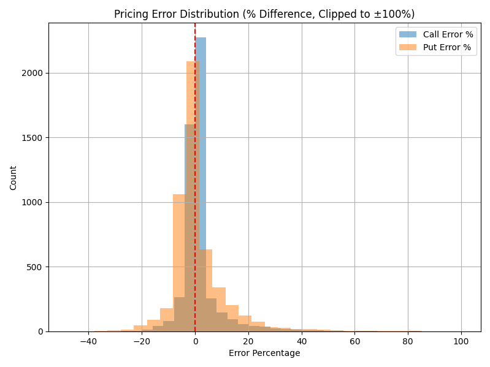
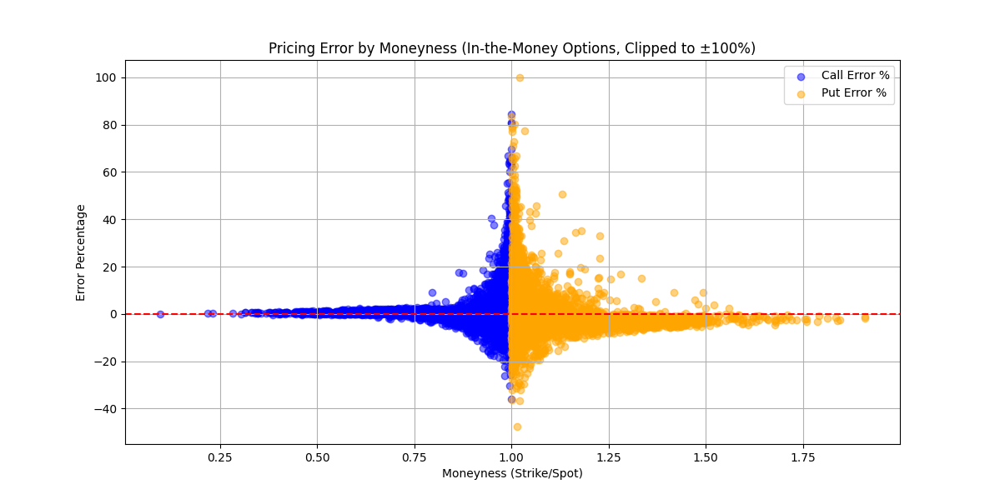
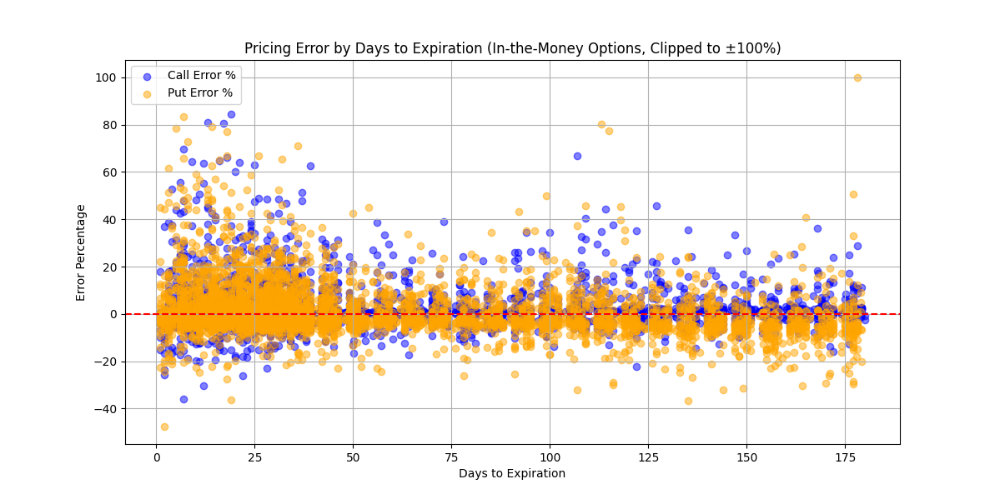
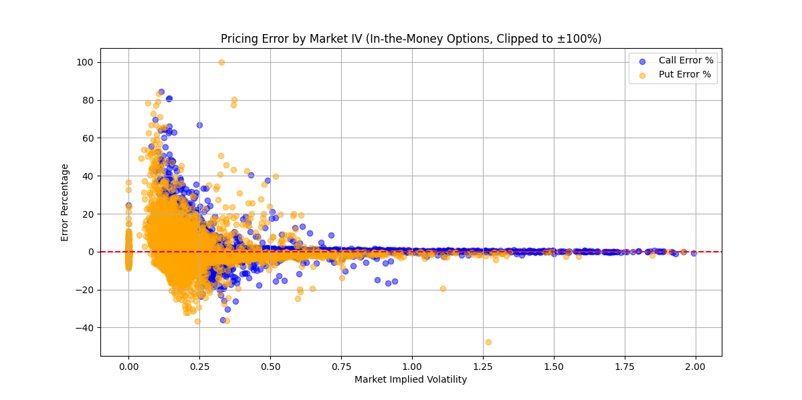

# Paninski method to price options using entropy derived volatility in the Black-Scholes model

This project implements an end-to-end workflow that uses information-theoretic metrics (Shannon entropy) to predict implied volatility and price options using the Black-Scholes model. The approach leverages Paninski's entropy estimation method to extract market uncertainty information from price returns.

## Pre-requisites

### To download historical spy options data (`./spy_2020_2022.csv`) please run 

```bash
#!/bin/bash
curl -L -o ./spy-daily-eod-options-quotes-2020-2022.zip\
  https://www.kaggle.com/api/v1/datasets/download/kylegraupe/spy-daily-eod-options-quotes-2020-2022
unzip spy-daily-eod-options-quotes-2020-2022.zip
```

### Install packages with anaconda or venv: 

```bash
python3 -m venv venv
source venv/bin/activate
pip install -r requirements.txt
```

### Usage

```bash
python3 entropyPricing.py
```

## Parameters and Configuration

The script includes several configurable parameters:

```python
# Visualization settings
ENABLE_PLOT = True              # Set to True to enable visualization

# Entropy estimation parameters
ENTROPY_BINS = 10               # Number of bins for discretization in entropy calculation
ENTROPY_REGULARIZATION = None   # Regularization parameter (None for automatic calculation)
MIN_SAMPLES_FOR_CORRELATION = 3 # Minimum samples required for correlation calculation

# Rolling window parameters
ROLLING_WINDOW_SIZES = [5,6,7,8,9,10,11,12,13,14,15,20,30,60]  # Window sizes for rolling entropy calculation
DEFAULT_WINDOW_SIZE = 11         # Default window size for visualization

# Lead-lag analysis parameters
MAX_LAG_DAYS = 10               # Maximum days to test for lead-lag relationships
LAG_STEP = 1                    # Step size between lag tests

# Risk-free rate (can be adjusted based on time period)
RISK_FREE_RATE = 0.03
```

The main function can be configured with the following options:

```python
if __name__ == "__main__":
    # Configuration:
    # - force_recalibrate=True to ensure models are calibrated for each window size
    # - use_cache=False to force recalculation of results
    # - save_results=True to save the results to disk
    # - optimize_window=True to find the best window size
    main(use_cache=False, save_results=True, min_option_price=1.0, max_error_pct=500, 
         force_recalibrate=True, optimize_window=False)
```

## Method Overview

The implementation follows a seven-stage workflow:

1. **Data acquisition**: Fetch S&P 500, VIX, and SPY data via yfinance and load option quotes
2. **Pre-processing**: Convert timestamps, calculate log returns, handle missing data
3. **Feature engineering**: Calculate Shannon entropy and historical volatility using rolling windows
4. **Model calibration**: Use OLS regression to predict implied volatility from entropy and historical volatility
5. **Option data processing**: Filter options by days to expiration, moneyness, and quote quality
6. **Option pricing**: Apply Black-Scholes with entropy-derived volatility to price options
7. **Performance analysis**: Calculate error metrics and analyze results by category

## Results

When running the optimization across different rolling window sizes, the following performance metrics were observed:

### Window Size Optimization Results

```
==== Summary of Results for Different Window Sizes ====
Window Size | Call MAE | Put MAE | Combined MAE | R-squared
------------|----------|---------|--------------|----------
          3 |    4.24% |   6.91% |        5.57% |    0.5874
          4 |    4.05% |   6.65% |        5.35% |    0.6532
          5 |    3.90% |   6.47% |        5.18% |    0.6928
          6 |    3.80% |   6.35% |        5.07% |    0.7166
          7 |    3.73% |   6.27% |        5.00% |    0.7308
          8 |    3.70% |   6.20% |        4.95% |    0.7364
          9 |    3.67% |   6.15% |        4.91% |    0.7415
         10 |    3.66% |   6.11% |        4.89% |    0.7438
         11 |    3.65% |   6.10% |        4.87% |    0.7461
         12 |    3.65% |   6.08% |        4.86% |    0.7446
         13 |    3.65% |   6.08% |        4.86% |    0.7430
         14 |    3.66% |   6.08% |        4.87% |    0.7387
         15 |    3.68% |   6.10% |        4.89% |    0.7320
         20 |    3.74% |   6.17% |        4.96% |    0.6981
         30 |    3.91% |   6.34% |        5.13% |    0.6453
         60 |    3.91% |   6.28% |        5.09% |    0.5071
```

The optimal window size was found to be 11 days, which minimizes the combined Mean Absolute Error (MAE) of 4.87% while explaining 74.61% of VIX variance (R-squared).

**Note:** Running with a large number of `ROLLING_WINDOW_SIZES` and `optimize_window=True` can take a long time (60+ minutes).

### Performance Metrics (with window size=11)

**Model Calibration Metrics:**
- R-squared: 0.7461
- RMSE: 0.0416
- MAE: 0.0325

**Option Pricing Error Metrics:**
- Call option MAE: 3.65%
- Put option MAE: 6.10%

**Example Option Pricing using Entropy-Derived Volatility:**
```
Date: 2024-12-30 00:00:00
SPY Price: $586.46
Strike Price: $615.78
Days to Expiry: 30
Entropy: 3.0419
Historical Volatility: 0.2008
Entropy-Derived Implied Volatility: 0.2299
Call Option Price: $5.62
Put Option Price: $33.43
```

**Error Distribution Percentiles (Call Options):**
- 5th Percentile: -5.42%
- Median Error: 0.37%
- 95th Percentile: 15.10%

**Error Distribution Percentiles (Put Options):**
- 5th Percentile: -9.76%
- Median Error: -1.16%
- 95th Percentile: 19.25%

### Data Processing Statistics
- Total options considered: 3,044,617
- Options retained after filtering: 2,027,720 (66.6%)

## Visualizations

### Error Distribution

*Distribution of pricing errors (% difference) between model and market prices*

### Error by Moneyness

*Pricing error as a function of option moneyness (Strike/Spot)*

### Error by Days to Expiration

*Pricing error as a function of days to expiration*

### Error by Implied Volatility

*Pricing error as a function of market implied volatility*
